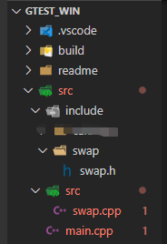
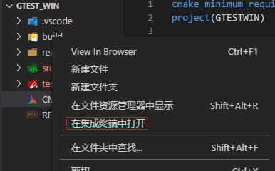

@[toc]

## 概述
    最近尝试在windows下使用googletest, 并使用CMake进行构建，把学习的过程记录下来。
    构建环境和工具：
    1、win10 64位
    2、visual studio code
    3、CMake for windows
    4、mingw64 for window
    5、LLVM for windows

## 一、环境准备

需要准备如下环境：
- 1、mingw64,并配置mingw64下的bin目录为环境变量
  


- 2、cmake程序，并配置cmake.exe所在的目录为环境变量
  


- 3、LLVM，并配置其bin目录为环境变量


- 4、Visual Studio code安装，并安装C/C++插件。

## 二、源码准备

创建一个待测的源码，为了更贴合项目工程，这里直接使用CMake工程的方式构建源码，以一个两个数交换值的例程举例。

先创建一个gtest_win目录，然后使用vscode打开这个文件夹，

使用vscode在gtest_win里面创建一个src文件夹，用来放源码，

src文件夹下面创建include文件夹，用于存放头文件，创建swap文件夹，然后新建swap.h头文件

swap.h文件内容如下：
```c
#ifndef __SWAP_H_
#define __SWAP_H_


void swap(int &a, int &b);

#endif // !__SWAP_H_
```

再创建src文件夹用于存放源文件,在gtest_win/src/src下创建swap.cpp文件，文件内容如下：
```c
#include "swap/swap.h"

/**
 * @description: 两个数交换
 * @param : 传入两个值
 * @return {*}
 */
void swap(int &a, int &b) {
    int temp;
    temp = a;
    a = b;
    b = temp;
}
```
在gtest_win/src下创建main.cpp文件，文件内容如下：
```c

#include <iostream>

#include "swap/swap.h"

using namespace std;

int main(int argc, char **argv) {
    int val1 = 10;
    int val2 = 20;
    cout << "before swap: val1=" << val1 << ", val2=" << val2 << endl;
    swap(val1, val2);
    cout << "after swap: val1=" << val1 << ", val2=" << val2 << endl;
    return 0;
}
```

最后在gtest_win目录下创建CMakeLists.txt文件，文件内容如下：
```c
cmake_minimum_required(VERSION 3.0)  # cmake -G "MinGW Makefiles" ..
project(GTESTWIN)

# 头文件目录
include_directories("${CMAKE_CURRENT_SOURCE_DIR}/src/include")
# 源文件目录
AUX_SOURCE_DIRECTORY("${CMAKE_CURRENT_SOURCE_DIR}/src/src" DIR_SRCS)

# 生成可执行文件
add_executable(gtest_win ./src/main.cpp ${DIR_SRCS})
```

创建在gtest_win下创建build目录，用于存放构建的产物，这样就不会在源码中输出乱七八糟的东西让目录变得很乱。
最后目录结构如下：



VSCODE下右键build文件夹，在集成终端中打开



输入如下命令进行构建并编译，确保我们准备的待测源码可以正常编译和执行：

    cmake -G "MinGW Makefiles" ..
    make
    gtest_win.exe

一切正常将会输出如下内容，这样我们的待测源码就准备好了：
```c
D:\Projects\gtest181\gtest_win\build>cmake -G "MinGW Makefiles" ..
-- The C compiler identification is GNU 8.1.0
-- The CXX compiler identification is GNU 8.1.0
-- Check for working C compiler: D:/Program Files/mingw64/bin/gcc.exe
-- Check for working C compiler: D:/Program Files/mingw64/bin/gcc.exe - works
-- Detecting C compiler ABI info
-- Detecting C compiler ABI info - done
-- Detecting C compile features
-- Detecting C compile features - done
-- Check for working CXX compiler: D:/Program Files/mingw64/bin/g++.exe
-- Check for working CXX compiler: D:/Program Files/mingw64/bin/g++.exe - works
-- Detecting CXX compiler ABI info
-- Detecting CXX compiler ABI info - done
-- Detecting CXX compile features
-- Detecting CXX compile features - done
-- Configuring done
-- Generating done
-- Build files have been written to: D:/Projects/gtest181/gtest_win/build

D:\Projects\gtest181\gtest_win\build>make
Scanning dependencies of target gtest_win
[ 33%] Building CXX object CMakeFiles/gtest_win.dir/src/main.cpp.obj
[ 66%] Building CXX object CMakeFiles/gtest_win.dir/src/src/swap.cpp.obj
[100%] Linking CXX executable gtest_win.exe
[100%] Built target gtest_win

D:\Projects\gtest181\gtest_win\build>gtest_win.exe
before swap: val1=10, val2=20
after swap: val1=20, val2=10

D:\Projects\gtest181\gtest_win\build>
```


## 三、准备googletest源码和测试代码

1、在gtest_win目录下创建test文件夹，用于存放googletest源码和我们的测试代码。
把下载下来的googletest-release-1.8.1文件夹放到test文件夹下。

googletest-release-1.8.1下载方法可参考：[https://blog.csdn.net/wdcyf15/article/details/108855960](https://blog.csdn.net/wdcyf15/article/details/108855960)


2、在test文件夹下创建test_swap.cpp文件，文件内容如下：
```c
#include <limits.h>
#include "gtest/gtest.h"
#include "gmock/gmock.h"

#include <cstdlib>
#include <iostream>
#include <string>

#include "swap/swap.h"


using ::testing::_;
using ::testing::Return;
using ::testing::AtLeast;
using ::testing::Exactly;
using namespace testing;
using namespace std;


TEST(SWAP_TEST, SWAP_TWO_INT) {
    int val1 = 10;
    int val2 = 20;
    swap(val1, val2);
    EXPECT_EQ(20, val1);
    EXPECT_EQ(10, val2);
}
```

3、在test文件夹下创建CMakeLists.txt文件，用于构建测试程序，文件内容如下：
```c
cmake_minimum_required(VERSION 3.0)  # cmake -G "MinGW Makefiles" ..
project(GTESTWIN_TEST)

# gtest库相关
# 如果把gtest放到test目录下，则使用如下包含关系：
add_subdirectory(./googletest-release-1.8.1)  # 编译gtest
include_directories(${CMAKE_CURRENT_SOURCE_DIR}/googletest-release-1.8.1/googletest/include)  # 包含gtest等头文件
include_directories(${CMAKE_CURRENT_SOURCE_DIR}/googletest-release-1.8.1/googlemock/include)  # 包含gmock等头文件


# 头文件目录
include_directories("../src/include")
# 源文件目录
AUX_SOURCE_DIRECTORY("../src/src" SRCS)

# 测试代码目录
AUX_SOURCE_DIRECTORY("${CMAKE_CURRENT_SOURCE_DIR}" TEST_SRCS)

# 生成测试可执行程序
add_executable(gtest_win_test ${DIR_SRCS} ${TEST_SRCS})

# 链接测试库,pthread 库一定要写在 ${GTEST_BOTH_LIBRARIES} 的后面, 否则编译时会报错,
# GTEST_BOTH_LIBRARIES表示链接google test的两个库
target_link_libraries( gtest_win_test
        PRIVATE 
        gtest
        gtest_main  # 使用gtest带的main函数,如果检测到外部有main函数，则使用外部main函数,外部main函数要配置gtest初始化。
        gmock
        gmock_main  # 使用gmock带的main函数,如果检测到外部有main函数，则使用外部main函数,与gtest_main同时存在则自动配置。
        pthread )

```

test最终的目录结构如下：


这样测试代码就准备好了，下面我们开始构建和编译测试代码。

## 四、构建并编译源码和测试代码

在此我们将把测试代码作为源码的子工程添加到源码中，测试代码的CMake工程为test文件夹，
所有我们修改gtest_win目录下的CMakeLists.txt，在最后一行添加：

    add_subdirectory(test)

文件所有内容如下：
```c
cmake_minimum_required(VERSION 3.0)  # cmake -G "MinGW Makefiles" ..
project(GTESTWIN)

# 头文件目录
include_directories("${CMAKE_CURRENT_SOURCE_DIR}/src/include")
# 源文件目录
AUX_SOURCE_DIRECTORY("${CMAKE_CURRENT_SOURCE_DIR}/src/src" DIR_SRCS)

# 生成可执行文件
add_executable(gtest_win ./src/main.cpp ${DIR_SRCS})

# 增加测试工程
add_subdirectory(test)
```

再次打开build目录终端，输入如下命令进行构建和编译：

    cmake -G "MinGW Makefiles" ..
    make

如果顺利，将会输出如下内容：

```c
D:\Projects\gtest181\gtest_win\build>cmake -G "MinGW Makefiles" ..
-- The C compiler identification is GNU 8.1.0
-- The CXX compiler identification is GNU 8.1.0
-- Check for working C compiler: D:/Program Files/mingw64/bin/gcc.exe
-- Check for working C compiler: D:/Program Files/mingw64/bin/gcc.exe - works
-- Detecting C compiler ABI info
-- Detecting C compiler ABI info - done
-- Detecting C compile features
-- Detecting C compile features - done
-- Check for working CXX compiler: D:/Program Files/mingw64/bin/g++.exe
-- Check for working CXX compiler: D:/Program Files/mingw64/bin/g++.exe - works
-- Detecting CXX compiler ABI info
-- Detecting CXX compiler ABI info - done
-- Detecting CXX compile features
-- Detecting CXX compile features - done
-- Found PythonInterp: C:/Users/uidq0460.V01/AppData/Local/Programs/Python/Python37/python.exe (found version "3.7.3")
-- Configuring done
-- Generating done
-- Build files have been written to: D:/Projects/gtest181/gtest_win/build

D:\Projects\gtest181\gtest_win\build>make
Scanning dependencies of target gtest_win
[  7%] Building CXX object CMakeFiles/gtest_win.dir/src/main.cpp.obj
[ 14%] Building CXX object CMakeFiles/gtest_win.dir/src/src/swap.cpp.obj
[ 21%] Linking CXX executable gtest_win.exe
[ 21%] Built target gtest_win
Scanning dependencies of target gtest
[ 28%] Building CXX object test/googletest-release-1.8.1/googlemock/gtest/CMakeFiles/gtest.dir/src/gtest-all.cc.obj
[ 35%] Linking CXX static library libgtest.a
[ 35%] Built target gtest
Scanning dependencies of target gtest_main
[ 42%] Building CXX object test/googletest-release-1.8.1/googlemock/gtest/CMakeFiles/gtest_main.dir/src/gtest_main.cc.obj
[ 50%] Linking CXX static library libgtest_main.a
[ 50%] Built target gtest_main
Scanning dependencies of target gmock
[ 57%] Building CXX object test/googletest-release-1.8.1/googlemock/CMakeFiles/gmock.dir/src/gmock-all.cc.obj
[ 64%] Linking CXX static library libgmock.a
[ 64%] Built target gmock
Scanning dependencies of target gmock_main
[ 71%] Building CXX object test/googletest-release-1.8.1/googlemock/CMakeFiles/gmock_main.dir/src/gmock_main.cc.obj
[ 78%] Linking CXX static library libgmock_main.a
[ 78%] Built target gmock_main
Scanning dependencies of target gtest_win_test
[ 85%] Building CXX object test/CMakeFiles/gtest_win_test.dir/__/src/src/swap.cpp.obj
[ 92%] Building CXX object test/CMakeFiles/gtest_win_test.dir/test_swap.cpp.obj
[100%] Linking CXX executable gtest_win_test.exe
[100%] Built target gtest_win_test

D:\Projects\gtest181\gtest_win\build>
```

可以看到
[ 21%] Built target gtest_win 表示生成了gtest_win.exe可执行程序
[100%] Built target gtest_win_test 表示生成了gtest_win_test.exe可执行程序


## 五、执行测试

因为我们的测试程序是测试程序的子工程，所以编译之后，在build目录下只看到gtest_win.exe，

并没有看到gtest_win_test.exe，我们需要cd test进入test目录，才看到gtest_win_test.exe程序，

输入gtest_win_test.exe执行该测试程序，就可以开始测试了：
```c
D:\Projects\gtest181\gtest_win\build>cd test

D:\Projects\gtest181\gtest_win\build\test>gtest_win_test.exe
Running main() from D:\Projects\gtest181\gtest_win\test\googletest-release-1.8.1\googletest\src\gtest_main.cc
[==========] Running 1 test from 1 test case.
[----------] Global test environment set-up.
[----------] 1 test from SWAP_TEST
[ RUN      ] SWAP_TEST.SWAP_TWO_INT
[       OK ] SWAP_TEST.SWAP_TWO_INT (0 ms)
[----------] 1 test from SWAP_TEST (5 ms total)

[----------] Global test environment tear-down
[==========] 1 test from 1 test case ran. (19 ms total)
[  PASSED  ] 1 test.

D:\Projects\gtest181\gtest_win\build\test>
```

## 六、总结

到此，在windows下使用gtest和cmake进行构建和编译执行测试的工程完成了，跟linxu下的差不多，如果使用VS构建，需要CMAKE构建生成MSCV工程，然后使用VS打开进行编译，本篇使用VSCODE，可以参考。

## 七、源码获取

本例程的源码可到此下载：[https://github.com/TonsenWei/gtest_win](https://github.com/TonsenWei/gtest_win)